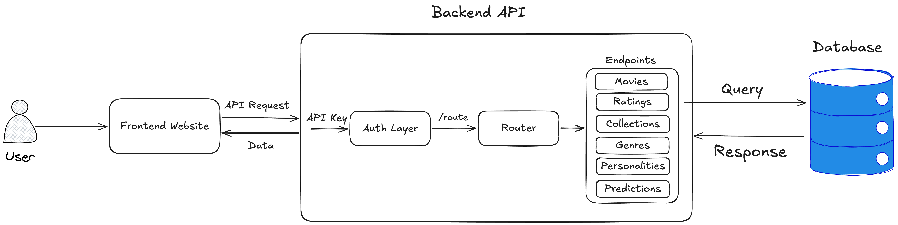

# MoviesDB

A full-stack web application for exploring and analysing the MovieLens dataset, built as coursework for COMP0022 (Databases and Web Application).

## Features

- **Movie Catalogue** — Browse 9,700+ films with search, genre filtering, year range, and rating thresholds
- **Genre Reports** — Popularity rankings and polarisation analysis across all genres
- **Rating Patterns** — Viewer behaviour analysis, cross-genre preferences, and critic classification
- **Predictive Ratings** — Genre-similarity based rating predictions with confidence intervals
- **Personality Analysis** — Big Five trait correlations with viewing preferences and viewer segments
- **Collections** — Create and manage personal movie lists (requires authentication)
- **My Ratings** — Rate movies and track your personal rating history
- **Multi-Source Ratings** — Aggregated scores from MovieLens, IMDb, TMDB, Rotten Tomatoes, and Metacritic

## Architecture



## Quick Start

```bash
git clone https://github.com/abdulrahman-abdulmojeeb/movies-db.git
cd movies-db
./setup.sh
```

This will:
1. Create a `.env` file from `.env.example` (if not present)
2. Download the MovieLens small dataset
3. Build Docker images
4. Start containers and wait for API health
5. Load movies & genres
6. Load ratings (~100K rows)
7. Load tags, links & personality data
8. Generate synthetic personality profiles
9. Sync enrichment data (posters, overviews, external ratings) from production server
10. Create default user (`admin` / `comp22`)

## Services

| Service  | URL                       |
|----------|---------------------------|
| Frontend | http://localhost:5173      |
| API      | http://localhost:8000      |
| API Docs | http://localhost:8000/docs |
| Database | localhost:5432             |

## Project Structure

```
movies-db/
  api/                # FastAPI backend
    app/
      auth/           # JWT authentication (register, login, refresh)
      routers/        # API endpoint modules (6 routers)
      middleware/     # Rate limiting
    tests/            # pytest test suite
  frontend/           # React + TypeScript + Vite
    src/
      components/
        layout/       # Sidebar, ThemeProvider
        ui/           # 16 shadcn/ui components
      pages/          # 10 application pages
      hooks/          # Auth and theme hooks
      services/       # Axios API client with interceptors
  database/
    init/             # SQL schema, indexes, external ratings
  scripts/            # Data loading and enrichment
  k8s/                # Kubernetes deployment manifests
```

## API Endpoints

35 endpoints across 7 groups:

| Group        | Endpoints                                                         |
|-------------|-------------------------------------------------------------------|
| Root        | `GET /` info, `GET /health` health check                          |
| Auth        | `POST` register, login, refresh; `GET` `PATCH` profile            |
| Movies      | `GET` list (paginated + filtered), detail, rating distribution    |
| Genres      | `GET` list, popularity, polarisation                              |
| Ratings     | `GET` patterns, cross-genre, low-raters, consistency; `POST` `GET` `DELETE` user ratings |
| Predictions | `POST` predict; `GET` similar, preview panel                      |
| Personality | `GET` traits overview, genre correlation, genre profile, segments |
| Collections | Full CRUD + add/remove movies (authenticated)                     |

## Kubernetes Deployment

Deploy to a Kubernetes cluster:

```bash
kubectl apply -f k8s/namespace.yaml
kubectl apply -f k8s/configmap.yaml
kubectl apply -f k8s/secret.yaml        # edit secrets first
kubectl apply -f k8s/postgres-statefulset.yaml
kubectl apply -f k8s/api-deployment.yaml
kubectl apply -f k8s/frontend-deployment.yaml
kubectl apply -f k8s/ingress.yaml
kubectl apply -f k8s/hpa.yaml
```

## Environment Variables

Copy `.env.example` to `.env` and configure:

| Variable           | Default                  | Description                     |
|-------------------|--------------------------|---------------------------------|
| POSTGRES_DB       | moviesdb                 | Database name                   |
| POSTGRES_USER     | moviesdb                 | Database user                   |
| POSTGRES_PASSWORD | moviesdb                 | Database password               |
| JWT_SECRET        | change-me-in-production  | JWT signing secret              |
| TMDB_API_KEY      |                          | TMDB API key (optional)         |
| OMDB_API_KEY      |                          | OMDB API key (optional)         |
| ALLOWED_ORIGINS   | http://localhost:5173    | CORS allowed origins            |
| VITE_API_URL      | http://localhost:8000    | Backend URL for frontend proxy  |

## Tech Stack

- **Backend**: Python 3.13, FastAPI 0.135, SQLAlchemy 2.0, psycopg2, JWT + Argon2 auth
- **Frontend**: React 19, TypeScript 5.9, Vite 7, Tailwind CSS 4, shadcn/ui, Recharts 3, TanStack Query
- **Database**: PostgreSQL 18 with 30+ optimised indexes
- **Deployment**: Docker Compose (development), Kubernetes (production)
- **Testing**: pytest 9 with mocked database layer
